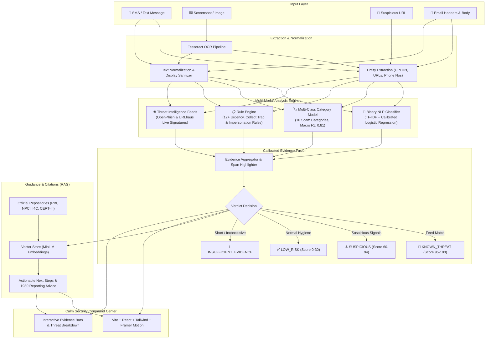

# ScamShield AI 🛡️
> **Multimodal Personal Digital-Safety Assistant (India-Focused)**  
> *Detect → Investigate → Explain → Verify → Act Safely*

ScamShield AI is an intelligent digital safety assistant engineered to protect Indian citizens from escalating payment frauds, social engineering, impersonation attacks, and phishing traps. A user submits a suspicious SMS, screenshot, link, or email and receives a definitive 0–100 risk score, category classification, span-level evidence, threat-intel verification, plain-language guidance, and official citations (RBI, NPCI, I4C).

---

## 🏛️ System Architecture



---

## 🚀 Quick Start

### Option 1: Docker Compose (Recommended)

Run the entire stack (FastAPI Backend, React Frontend, and MLflow UI) in one command:

```powershell
# 1. Clone repository
git clone https://github.com/ameypadyar22/ScamShield.git
cd ScamShield

# 2. Configure environment
cp .env.example .env

# 3. Build and launch containers
docker compose up --build
```

- **Frontend Application**: [http://localhost:5173](http://localhost:5173)
- **Backend API Docs**: [http://localhost:8000/docs](http://localhost:8000/docs)
- **MLflow Tracking UI**: [http://localhost:5000](http://localhost:5000)

---

### Option 2: Local Development

#### Prerequisites
- Python 3.11+
- Node.js 20+
- Tesseract OCR (`tesseract` in system PATH)

#### 1. Backend Setup
```powershell
# Create and activate virtual environment
python -m venv .venv
.\.venv\Scripts\activate

# Install dependencies
python -m pip install --upgrade pip
pip install -r backend/requirements.txt
pip install reportlab pytest ruff
python -m spacy download en_core_web_sm

# Launch FastAPI development server
uvicorn backend.app.main:app --reload --port 8000
```

#### 2. Frontend Setup
```powershell
cd frontend
npm install
npm run dev
```

#### 3. MLflow Tracking
```powershell
.\.venv\Scripts\python.exe -m mlflow ui
# Navigate to http://localhost:5000
```

---

## 📊 Model Evaluation & Benchmarks

Full benchmarks are documented in [`docs/EVAL.md`](docs/EVAL.md).

### Binary Text Model Comparison (UCI SMS Spam Holdout)

| Model | Accuracy | Precision | Recall (TPR) | F1-Score | ROC-AUC | FPR | Status |
|---|---|---|---|---|---|---|---|
| **Logistic Regression** | **0.9839** | **0.9396** | **0.9396** | **0.9396** | **0.9920** | **0.0093** | **Selected** |
| Support Vector Machine (Linear) | 0.9874 | 0.9720 | 0.9329 | 0.9521 | 0.9896 | 0.0041 | Evaluated |
| Random Forest | 0.9794 | 1.0000 | 0.8456 | 0.9164 | 0.9930 | 0.0000 | Evaluated |
| XGBoost | 0.9821 | 0.9850 | 0.8792 | 0.9291 | 0.9817 | 0.0021 | Evaluated |
| Decision Tree | 0.9722 | 0.9338 | 0.8523 | 0.8912 | 0.8881 | 0.0093 | Evaluated |
| K-Nearest Neighbors | 0.9516 | 0.9897 | 0.6443 | 0.7805 | 0.8612 | 0.0010 | Evaluated |

*Optimization criteria: Maximizing Recall while maintaining false positive rate (FPR) $\le$ 0.05 (Principle #5).*

### Multi-Class Scam Category Model (Handwritten Benchmark Benchmark)

- **Selected Model**: TF-IDF + Logistic Regression
- **Benchmark Accuracy**: **82.50%**
- **Macro F1 Score**: **0.8124**
- **Evaluation Dataset**: 40 held-out Indian scam messages across 10 distinct categories.

---

## 📸 Interface & Visual Walkthrough

| Screen | Description |
|---|---|
| **Scanner Dashboard** | Clean dark security command-center with tabs for Text, Screenshot, URL, and Email. |
| **Evidence Breakdown** | Span-highlighted input text with weighted evidence bars for Rules, ML, and Intel feeds. |
| **Risk Gauge** | Calibrated 0–100 animated score dial with WCAG-compliant verdict status badges. |
| **RAG Copilot Drawer** | Cited safety steps referencing NPCI UPI rules, RBI booklets, and 1930 reporting. |

*(Sample threat screenshots cataloged in [`ml/data/demo_screenshots/`](ml/data/demo_screenshots/)).*

---

## 🔌 API Endpoints Contract

| Method | Endpoint | Description |
|---|---|---|
| `GET` | `/health` | Application status, API version, and database connectivity. |
| `POST` | `/analyze/message` | Comprehensive multi-modal text scam evaluation. |
| `POST` | `/api/analyze` | Frontend compatibility alias for analysis. |
| `GET` | `/analysis/{id}` | Retrieve historical analysis report by unique ID. |
| `GET` | `/analysis/history` | Paginated search of past scans with category filters. |
| `POST` | `/copilot/chat` | Context-aware RAG safety copilot assistant. |

---

## 🛡️ Non-Negotiable Safety Principles

1. **The LLM Never Decides the Verdict**: Deterministic ML models, verified threat intelligence, and transparent heuristics produce evidence. Language models only format explanations and orchestrate tool lookups.
2. **Never Overclaim**: We present "high-risk fraud characteristics detected", never "definitely a scam". All analyses include explicit limitations notices.
3. **Discrete Verdicts**: Exactly four possible outcomes: `KNOWN_THREAT`, `SUSPICIOUS`, `LOW_RISK`, `INSUFFICIENT_EVIDENCE`. Absence of feed matches is never treated as proof of safety.
4. **Credential Safety**: ScamShield AI never asks for, captures, or stores UPI PINs, passwords, or OTPs. If financial loss has occurred, users are immediately directed to national helpline **1930** and **cybercrime.gov.in**.
5. **SSRF-Safe**: Submitted URLs are never rendered or fetched server-side; evaluation relies exclusively on lexical feature extraction and feed cache matching.